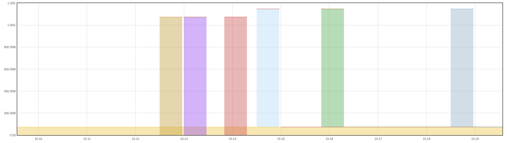
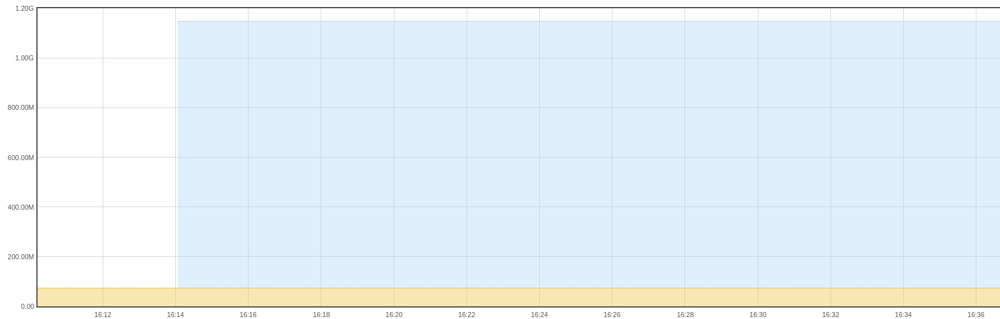
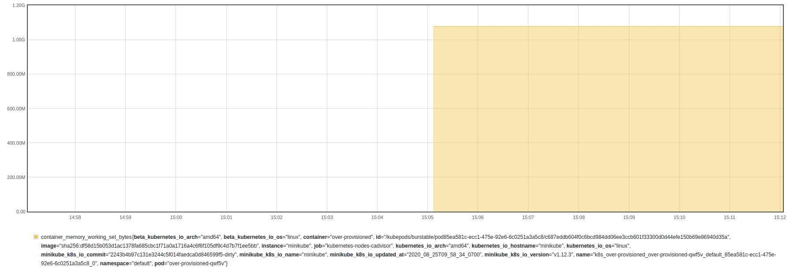

# k8s-jobs-example

## Questions

1. How do different failure conditions (e.g. non-zero exit code, invalid
   podspec) affect retry and resource consumption?

2. What kind of resource usage information is available to choose appropriate
   allocations for jobs?

3. Are logs from job-pods being collected and retained?

### Question 1: Failure Conditions

#### Non-zero exit code

This failure condition simulated by [a busybox sleep and non-zero exit
spec](exit-nonzero-job.yml) in the same way as an unhandled exception in a real
task.

https://kubernetes.io/docs/concepts/workloads/controllers/job/#pod-backoff-failure-policy

By default, jobs have a restartPolicy of Never and a backoffLimit of 6. This
means the main container inside the pod will not be restarted if it exits 1 and
the pod will be created up to 6 times:

```
Name:           exit-nonzero
...
Pods Statuses:  0 Running / 0 Succeeded / 6 Failed
...
    Requests:
      memory:     1Gi
...
Events:
  Type     Reason                Age    From            Message
  ----     ------                ----   ----            -------
  Normal   SuccessfulCreate      15m    job-controller  Created pod: exit-nonzero-szsld
  Normal   SuccessfulCreate      14m    job-controller  Created pod: exit-nonzero-nq9nb
  Normal   SuccessfulCreate      13m    job-controller  Created pod: exit-nonzero-bg2hf
  Normal   SuccessfulCreate      13m    job-controller  Created pod: exit-nonzero-9mggl
  Normal   SuccessfulCreate      11m    job-controller  Created pod: exit-nonzero-lklmw
  Normal   SuccessfulCreate      9m11s  job-controller  Created pod: exit-nonzero-txl6b
  Warning  BackoffLimitExceeded  3m51s  job-controller  Job has reached the specified backoff limit
```

Pod memory requests only apply from a scheduling point of view during the
Running phase, so each pod in the job had a 1Gi allocation while they were
running only. Graph also shows backoff timings nicely:

```
kube_pod_container_resource_requests_memory_bytes and on(pod) (kube_pod_status_phase{phase="Running"}==1)
```



#### Invalid PodSpec

Pods with an [invalid podspec such as a non-existent secret
mount](invalid-secret-job.yml) stay in the Waiting phase
(CreateContainerConfigError is the reason). Do Waiting pods count towards memory
requests from a scheduling point of view as well? It would appear so:

```
(⎈ |minikube:default) AWS: personal  ~/projects/k8s-jobs-example   master ●  kc describe node
Name:               minikube
...
Non-terminated Pods:  (15 in total)
  Namespace   Name                  CPU Requests  CPU Limits  Memory Requests  Memory Limits  AGE
  ---------   ----                  ------------  ----------  ---------------  -------------  ---
  default     invalid-secret-5st25  0 (0%)        0 (0%)      1Gi (6%)         0 (0%)         3m17s
...
Allocated resources:
  (Total limits may be over 100 percent, i.e., overcommitted.)
  Resource           Requests     Limits
  --------           --------     ------
  cpu                650m (5%)    0 (0%)
  memory             1094Mi (6%)  170Mi (1%)
...
```

To test further, the waiting pod memory request was increased to take most of
the node's available memory, then another large memory pod was run:

```
Name:         should-be-unschedulable
...
Status:       Pending
Containers:
  should-be-unschedulable:
    Requests:
      memory:     10Gi
Conditions:
  PodScheduled   False
...
Events:
  Type     Reason            Age                From               Message
  ----     ------            ----               ----               -------
  Warning  FailedScheduling  40s (x2 over 40s)  default-scheduler  0/1 nodes are available: 1 Insufficient memory.
```

Judging from this and the describe node output containing `Non-terminated Pods`,
a likely better PromQL for measuring memory allocation is:

```
kube_pod_container_resource_requests_memory_bytes and on(pod) (kube_pod_status_phase{phase!~"Terminated"}==1)
```

The memory usage while running this job was from a single pod which stayed in
the waiting phase while attempts to mount the non-existent secret were retried:



#### Conclusion

Two failure conditions (non-zero exit codes and invalid podspec) resulted in
different retry and memory allocation. Non-zero exit codes took memory while the
pod was running then released it, and retried backoffLimit times before leaving
memory free once more. Invalid podspecs never freed memory, from a single pod
that stayed in waiting state.

### Question 2: Resource usage and allocation

Choosing an appropriate request value probably requires data about the 'normal'
resource consumption of a job. Particularly regarding memory requests, if too
high, allocatable memory is limited and scheduling of other pods may be
prevented.

Can a [purposefully over-provisioned job](over-provisioned-job.yml) have it's
resource usage measured and visualised to choose appropriate request values?

The following prometheus query (which excludes pod overheads and some suspected
double reporting from docker) shows actual memory usage:

```
container_memory_working_set_bytes{pod=~"over-provisioned-.*",container!~"POD",container!="",id!~".*docker.*"}
```

Also the same data is reported via the [metrics API and
metrics-server](https://kubernetes.io/docs/tasks/debug-application-cluster/resource-metrics-pipeline/),
queryable from `kubectl top pod`



Monitored over a sufficient period of time, making it more likely that all
likely memory conditions are captured, a reasonable memory request can be
assigned. This could be set to cover most peaks, but not necessarily all peaks.
If there are rare peaks, the pod won't necessarily be evicted for exceeding
it's request - it just makes it a [more likely candidate for
eviction](https://kubernetes.io/docs/tasks/administer-cluster/out-of-resource/#evicting-end-user-pods)

### Question 3: Logging

Jobs create pods, which are [not removed after
completion/failure](https://kubernetes.io/docs/concepts/workloads/controllers/job/#job-termination-and-cleanup)
to allow manual log retrieval and getting other information from kube objects.

If the jobs are deleted, so are the corresponding pods it created. There is a
[controller in alpha to remove finished
jobs](https://kubernetes.io/docs/concepts/workloads/controllers/ttlafterfinished/)
but managed k8s services (like EKS but also others) tend to only support
features that are in [beta or
GA](https://kubernetes.io/docs/reference/command-line-tools-reference/feature-gates/#feature-stages).

Higher-level controllers may clean up the jobs though (and therefore their
pods) such as the CronJob controller and it's [failedJobsHistoryLimit and
successfulJobsHistoryLimit
settings](https://kubernetes.io/docs/reference/generated/kubernetes-api/v1.18/#cronjobspec-v1beta1-batch).
Because these settings retain *jobs* not *pods* it can appear it's not working
well. For example, with failedJobsHistoryLimit set to 3 on a CronJob, a history
of 3 failed jobs will be retained. Each of those jobs may have the default
backoffLimit of 6. For a recurring exception in the job, the result is 18 pods
in a failed state.

Since jobs just run pods, the retaining their logs is the same general log
aggregation and storage problem as for other kubernetes workloads. That would
be solved with some combination of the [cluster-level logging
architectures](https://kubernetes.io/docs/concepts/cluster-administration/logging/#cluster-level-logging-architectures)
such as node logging agents, sidecar containers and direct app to logging
backend integration.
